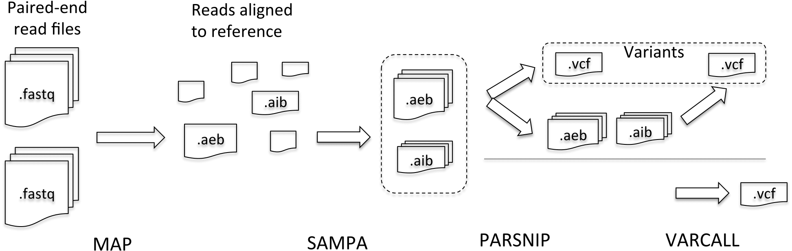

# SPRITE4 - Pipeline for fast, scalable variant detection

This repository contains source code for SPRITE4 pipeline to perform fast and scalable variant detection. 


## Assumptions and limitations

- FASTQ files are uncompressed and consist of reads < 120 bp. SPRITE4 cannot process reads > 120 bp.
- SPRITE4 can support single-end or paired-end FASTQ files. FASTQ file with interleaved paired-end reads is not supported.


## Files

The folder sprite4\_minimap2\_modified contains the modified source code for [Minimap2](https://github.com/lh3/minimap2) aligner. Modification includes:

- Support for multi-node parallelism using MPI
- Multi-threading using OpenMP
- AEB, AIB output files instead of SAM format
- Separate output files for different regions of reference genome

The folder sprite4\_strelka2\_modified contains the modified source code for [Strelka2](https://github.com/Illumina/strelka) variant caller. Modification includes:

- Support for multi-node parallelism using MPI
- AEB, AIB input file format
- Static load balancing to improve scalability

Source files included for sorting AEB, AIB files (sampa.c), performing SNP calling on simple reference regions (parsnip.c), combining the VCF output generated by strelka2 and PARSNIP in case of hybrid variant calling approach (mergeVCF.c)

Apart from this, test scripts are also included. sprite4-\*test

## Requirement

- Install [Miniconda][https://conda.io/miniconda.html]
- Add <Miniconda\_path/bin> to PATH environment variable

## Building SPRITE4 from source

Pre-built binaries are available for Linux x86\_64 architecture. This section is valid only for other architectures.
```
conda install conda-build
conda-build sprite4 --croot <SPRITE4_build_path>
```

## Installation

The package can be installed using [BIOCONDA](https://bioconda.github.io/) recipe. The installation command is:

- To install pre-built binary

```
conda install -c vasupsu sprite4
```

- To install locally-built binary

```
conda install --use-local sprite4
```

## References
1. Li, H. (2018). [Minimap2: pairwise alignment for nucleotide sequences]{https://academic.oup.com/bioinformatics/advance-article/doi/10.1093/bioinformatics/bty191/4994778}. Bioinformatics. doi:10.1093/bioinformatics/bty191
2. Kim, S., Scheffler, K. et al. (2017) [Strelka2: Fast and accurate variant calling for clinical sequencing applications](https://www.biorxiv.org/content/early/2017/09/23/192872). bioRxiv doi: 10.1101/192872

For questions, please contact Vasudevan Rengasamy, vas.renga@gmail.com
